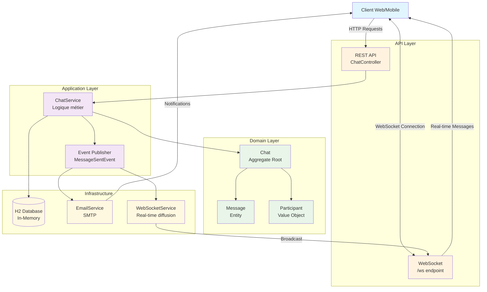

# Chat POC - Documentation Fonctionnelle

## Vue d'ensemble

Ce projet est une application de chat en temps réel développée avec Spring Boot, utilisant l'architecture Domain-Driven Design (DDD). Elle combine REST API, WebSocket pour le temps réel, et notifications email asynchrones.

## Architecture du projet

### Structure DDD
- **Domain** : Logique métier pure (Chat, Message, Participant)
- **Application** : Services applicatifs et orchestration
- **Infrastructure** : Implémentation technique (base de données, web, messaging)

### Technologies utilisées
- **Backend** : Spring Boot 3.2.0, Java 17
- **WebSocket** : Spring WebSocket avec STOMP
- **Base de données** : H2 en mémoire avec JPA/Hibernate
- **Documentation** : OpenAPI/Swagger
- **Email** : Spring Mail (SMTP local sur port 1025)
- **Tests** : JUnit 5, Mockito, TestContainers

## Fonctionnalités principales

### 1. Gestion des chats (REST API)

#### Créer un chat
- **Endpoint** : `POST /api/chats`
- **Fonction** : Crée un nouveau chat avec un nom et un créateur
- **Code** : `ChatController:87` → `ChatService:30`

#### Récupérer un chat
- **Endpoint** : `GET /api/chats/{chatId}`
- **Fonction** : Récupère les détails complets d'un chat
- **Code** : `ChatController:135`

#### Lister tous les chats
- **Endpoint** : `GET /api/chats`
- **Fonction** : Retourne la liste de tous les chats
- **Code** : `ChatController:159`

#### Envoyer un message
- **Endpoint** : `POST /api/chats/{chatId}/messages`
- **Fonction** : Envoie un message dans un chat spécifique
- **Code** : `ChatController:199` → `ChatService:43`

#### Récupérer les messages récents
- **Endpoint** : `GET /api/chats/{chatId}/messages?limit=50`
- **Fonction** : Récupère les N derniers messages d'un chat
- **Code** : `ChatController:251`

### 2. WebSocket en temps réel

#### Configuration
- **Endpoint de connexion** : `/ws`
- **Configuration** : `WebSocketConfig:11`
- **Support SockJS** : Oui, avec fallback automatique
- **Prefixes** :
  - `/app` : Messages entrants vers l'application
  - `/topic` : Diffusion publique
  - `/queue` : Messages privés
  - `/user` : Messages spécifiques à un utilisateur

#### Fonctionnement du WebSocket

1. **Connexion client** :
   ```javascript
   // Connexion WebSocket
   const socket = new SockJS('/ws');
   const stompClient = Stomp.over(socket);
   ```

2. **Abonnement aux messages** :
   ```javascript
   // S'abonner aux messages d'un chat
   stompClient.subscribe('/topic/chat/{chatId}', function(message) {
       const messageData = JSON.parse(message.body);
       // Afficher le message reçu
   });
   ```

3. **Diffusion automatique** :
   - Quand un message est envoyé via REST API (`ChatController:199`)
   - Un événement `MessageSentEvent` est publié (`Chat:52`)
   - Le `WebSocketService:24` écoute cet événement
   - Le message est automatiquement diffusé vers `/topic/chat/{chatId}`

#### Endpoint de test
- **URL** : `GET /ws/info`
- **Fonction** : Retourne les informations de configuration WebSocket
- **Test WebSocket** : `POST /app/test` → diffusion vers `/topic/test`

### 3. Système d'événements (Event-Driven)

#### Types d'événements
- **ChatCreatedEvent** : Publié à la création d'un chat (`Chat:27`)
- **MessageSentEvent** : Publié lors de l'envoi d'un message (`Chat:52`)

#### Event Listeners
1. **WebSocketService** : Diffuse les messages via WebSocket
2. **EmailService** : Envoie des notifications email

### 4. Notifications email asynchrones

#### Configuration
- **SMTP** : localhost:1025 (serveur de développement)
- **Asynchrone** : Oui, avec `@Async`
- **Code** : `EmailService:27`

#### Fonctionnement
1. Lors de l'envoi d'un message, un `MessageSentEvent` est publié
2. `EmailService` écoute cet événement de façon asynchrone
3. Un email de confirmation est envoyé à l'expéditeur

### 5. Modèle de données

#### Entité Chat (`Chat:9`)
- **ID** : UUID unique
- **Nom** : 3-100 caractères
- **Participants** : Set de participants (max 50)
- **Messages** : Liste chronologique des messages
- **Contraintes** : Validation du nom, limite de participants

#### Entité Message (`Message.java`)
- **ID** : UUID unique
- **Contenu** : Texte du message
- **Expéditeur** : Participant qui envoie le message
- **Timestamp** : Date/heure d'envoi

#### Entité Participant (`Participant.java`)
- **Nom** : ParticipantName (value object)
- **Email** : Email (value object avec validation)

## Flux de données complet

### Envoi d'un message
1. **Client** → `POST /api/chats/{chatId}/messages`
2. **ChatController** → `ChatService.sendMessage()`
3. **ChatService** → `Chat.sendMessage()` (logique métier)
4. **Chat** → Génère `MessageSentEvent`
5. **Persistence** → Sauvegarde en base H2
6. **Event Publishing** → Diffusion de l'événement
7. **WebSocketService** → Diffusion WebSocket vers `/topic/chat/{chatId}`
8. **EmailService** → Envoi email asynchrone
9. **Clients connectés** → Réception du message en temps réel

### Connexion WebSocket
1. **Client** → Connexion à `/ws`
2. **WebSocketConfig** → Configuration STOMP
3. **Client** → Abonnement à `/topic/chat/{chatId}`
4. **Réception automatique** des nouveaux messages

## Endpoints disponibles

### REST API
- `POST /api/chats` - Créer un chat
- `GET /api/chats` - Lister tous les chats
- `GET /api/chats/{chatId}` - Détails d'un chat
- `POST /api/chats/{chatId}/messages` - Envoyer un message
- `GET /api/chats/{chatId}/messages` - Messages récents

### WebSocket
- `/ws` - Endpoint de connexion
- `/topic/chat/{chatId}` - Abonnement aux messages d'un chat
- `/app/test` - Test de fonctionnement

### Utilitaires
- `/swagger-ui.html` - Documentation API interactive
- `/h2-console` - Console base de données H2
- `/ws/info` - Informations WebSocket

## Configuration pour démarrer

1. **Base de données** : H2 en mémoire (auto-configurée)
2. **SMTP** : Serveur local sur port 1025 (ex: MailHog)
3. **Port** : Application sur port 8080
4. **WebSocket** : Disponible immédiatement après démarrage

Le projet est prêt à fonctionner directement avec `mvn spring-boot:run`.

## Diagramme d'architecture

